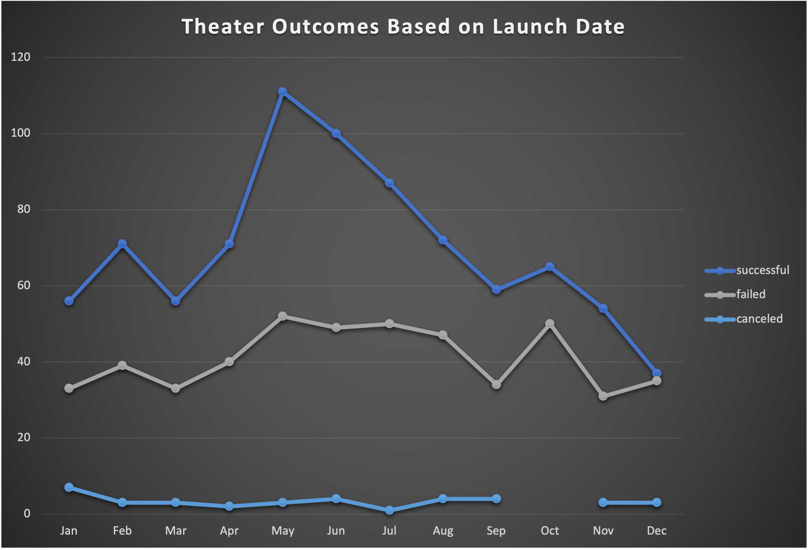
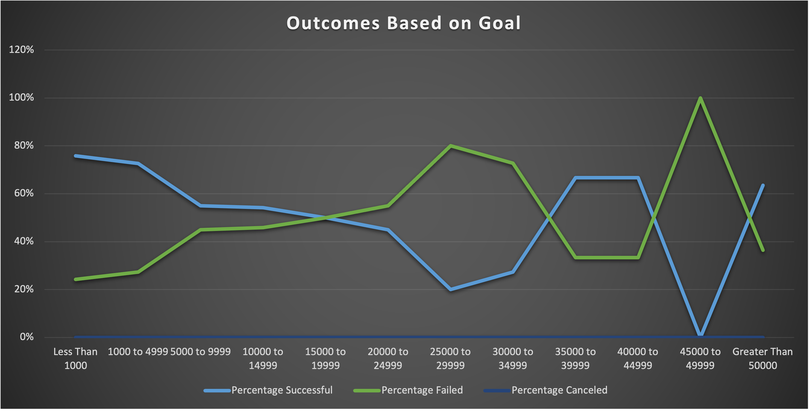

# Module_1_Challenge_Kickstarter_Analysis
Use of Kickstarter Analysis for Extra Use &amp; Data Analytics &amp; Data Storytelling

## Overview
Based off the Kickstarter data, we are determining the outcome of "Plays" from the Parent Category of "Theater" in relation to funding goals.
The analysis was based off data from the Excel file called "Kickstarter_Analysis"
* In that Excel file we performed Excel functions such as creation of Pivot Tables, Charts, Filters, VLOOKUP, and AVG
* That Excel file was also what we used for the Module 1 Challenge for determining the results of Outcomes based off goals from funding
* * However, I added the use of a couple more Charts as well as the use of COUNTIFS
* * COUNTIFS assisted me in determining the number of "successes", "fails, and "cancels" in relation to funding goals
* * * I was able to gather the charts by making a table of "successes", "fails", and "cancels" using the following Excel fomrula: =COUNTIFS(Kickstarter!$D:$D,"<1000",Kickstarter!$F:$F,"successful",Kickstarter!$R:$R,"plays")
* * * This formulas were modified internally for use on the different categories of dollar amounts
* * * The end table was this:
* * * * 
* * * * I also created a Chart from this table to visually view the results (picture to be seen in later paragraph)
* The challeneges that were faced were the Excel file lagging and/or slowing down as the Excel file began to contain more data & rows & pictures & charts
* Another challenge was the Excel formula needing to created and getting the right syntax down, as well as modifying the Excel formula to get the right result
* * Sometimes it became more time consuming than originally thought
* A unique issue was the Mac has the Excel cells smaller than on Windows, making it harder to keep track of what row and/or column I was at
* When it came to tables & charts a challenge was making sure the data was being properly represented & modifying the data fit the chart and/or graph as needed

## Theater Outcomes & Launch Dates
* 
* * Based off the data, we can conclude that the months of April-June are the best time to host a "Theater/Play". This needs to be taken into account with fundraising, which means fundraising for a "Theater/Play" that will occur in the months of April-June will likely be "successful" as the most people will come to view it.
* * September-December are the worst time to host a "Theater/Play". We can see the data showing us that that's when "Theaters/Plays" not only are more likely to "fail" but even the amounts of "successes" are lower.
* * Both of these finding need to be heavily considered for future fundraising.

## Ouctomes & Fundraising Goals
* 
* As seen on the graph, "Less than 1000 to 9999" and "35000 to 44999" are the amount where fundraising for Kickstarters is most effective.
* Also shown by the graph we can see that past 9999 the "percentage failed" rises while the "percenatage of successes" falls (overall).
* This is worrying as it means cost of Kickstarters are inversely related to it's success. The higher the fundraising goal the less likely the event will even be held.

## Recommendations & Improvements
* Overall, the main limitation is data showing us exaclty why more funding means less likely to "succeed". We can speculate but until we understand the market of people who are helping raise money is known, we are in the dark about why this trend is occurring.
* This means that we have a need for data on the population of those helping fund Kickstarters.
* * If we could get the data, we could make graphs & charts that incorporate how the population we have affects the "success" or "failure" of a Kickstarter campaign.
* * This data could come in Excel format and be easily combined or held side-by-side with the current data we have.
