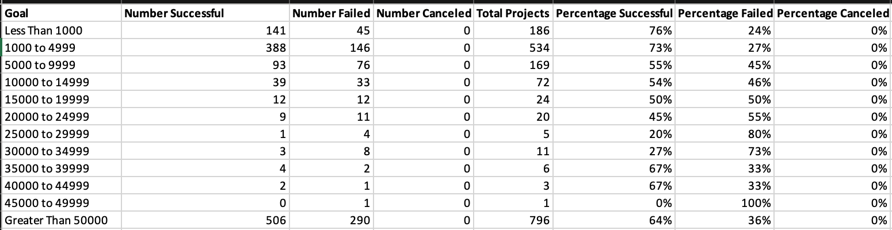

# Module_1_Challenge_Kickstarter_Analysis
Use of Kickstarter Analysis for Extra Use &amp; Data Analytics &amp; Data Storytelling

## Outcomes Based on Goal

Based off the Kickstarter data, we are determining the outcome of "Plays" from the Parent Category of "Theater" in relation to funding goals.

The analysis was based off data from the Excel file called "Kickstarter_Analysis"
* In that Excel file we performed Excel functions such as creation of Pivot Tables, Charts, Filters, VLOOKUP, and AVG
* That Excel file was also what we used for the Module 1 Challenge for determining the results of Outcomes based off goals from funding
* * However, I added the use of a couple more Charts as well as the use of COUNTIFS
* * COUNTIFS assisted me in determining the number of "successes", "fails, and "cancels" in relation to funding goals
* * * I was able to gather the charts by making a table of "successes", "fails", and "cancels" using the following Excel fomrula: =COUNTIFS(Kickstarter!$D:$D,"<1000",Kickstarter!$F:$F,"successful",Kickstarter!$R:$R,"plays")
* * * This formulas were modified internally for use on the different categories of dollar amounts
* * * The end table was this:
* * * * 
* * * * I also created a Chart from this table to visually view the results (picture to be seen in later paragraph)
* The challeneges that were faced were the Excel file lagging and/or slowing down as the Excel file began to contain more data & rows & pictures & charts
* Another challenge was the Excel formula needing to created and getting the right syntax down, as well as modifying the Excel formula to get the right result
* * Sometimes it became more time consuming than originally thought
* A unique issue was the Mac has the Excel cells smaller than on Windows, making it harder to keep track of what row and/or column I was at
* When it came to tables & charts a challenge was making sure the data was being properly represented & modifying the data fit the chart and/or graph as needed
* 
